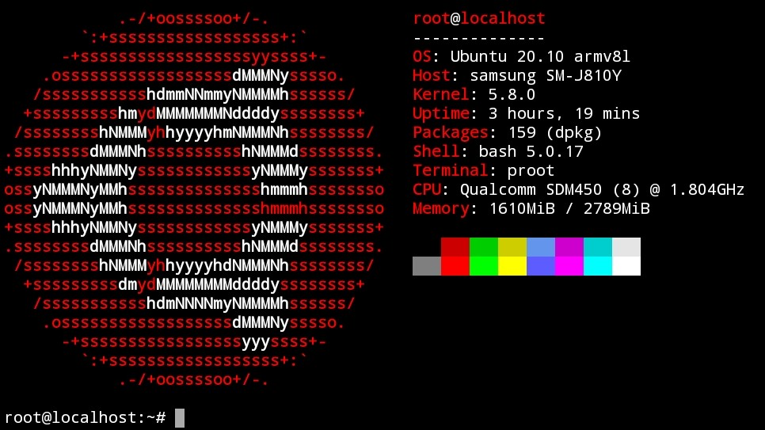

## Ubuntu 20.10 (Groovy Gorilla) in Termux

## Installation
```
curl --silent --location --remote-name https://github.com/trungtai33/ubuntu-groovy-in-termux/raw/master/install.sh && bash install.sh && rm install.sh
```
After installation, run ```start-ubuntu-groovy``` to login.
## Uninstall
Be careful when using this command as it does not ask for confirmation.
```
curl --silent --location --remote-name https://github.com/trungtai33/ubuntu-groovy-in-termux/raw/master/uninstall.sh && bash uninstall.sh && rm uninstall.sh
```
